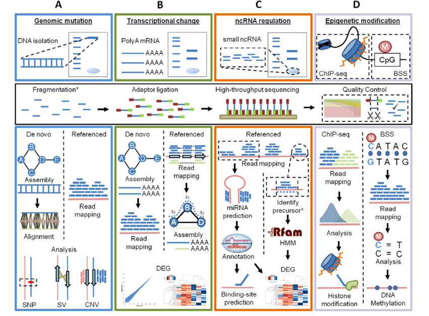

# Introduction to Genomics

**Chapter Objectives:**

-   Describe what makes up a gene and genome
-   Understand how genes and genomes are regulated
-   Differentiate between the different types of genome mutations
-   List the general steps required of high-throughput sequencing

## Genes, Genomes, and Genomics

DNA: the building blocks of life. 

Gene: A unit of nucleotides that when transcribed, create a functional
RNA sequence.

RNA: intermediate messenger; different types! 

Protein: macromolecules consisting of amino acids that are translated
from an RNA sequence. 

Genome: the sum of all genes; the instructions of life. 

Genomics: The study of genomes (structure, function, sequences)

## Gene regulation

The process by which genes are controlled. When they are turned on or
off, how much to make. Often has a cascading effect.

### Transcriptional regulation

Control output of transcripts *before* transcription occurs.

Transcription factors 
Epigenetic (histone) modifications 

### Post-transcriptional regulation

Control what happens to transcripts *after* they are made.

Splicing 

non-coding RNAs (ncRNAs) 

## Genetic mutations

Gene-level mutations 

Chromosomal-level mutations 

## Sequencing


## Resources

-   General knowledge
    -   [Kahn
        Academy](https://www.khanacademy.org/science/ap-biology/gene-expression-and-regulation)

    -   [Genome.gov](https://www.genome.gov/about-genomics/fact-sheets/A-Brief-Guide-to-Genomics)
-   NGS Sequencing
    -   Sequencing by Synthesis (Illumina)

        -   [Intro to Illumina
            Seq](https://www.youtube.com/watch?v=CZeN-IgjYCo)

        -   [Illumina Official
            Video](https://www.youtube.com/watch?v=fCd6B5HRaZ8)

    -   Nanopore (Oxford Nanopore Technologies)

        -    [Nanopore DNA
            Sequencing](https://www.youtube.com/watch?v=E9-Rm5AoZGw)

        -   [ONT Official
            Video](https://www.youtube.com/watch?v=sv9fFeSd3kE)

## Meeting Videos

### Cohort 1

`r knitr::include_url("https://www.youtube.com/embed/URL")`

<details>
<summary>Meeting chat log</summary>

```
LOG
```
</details>
