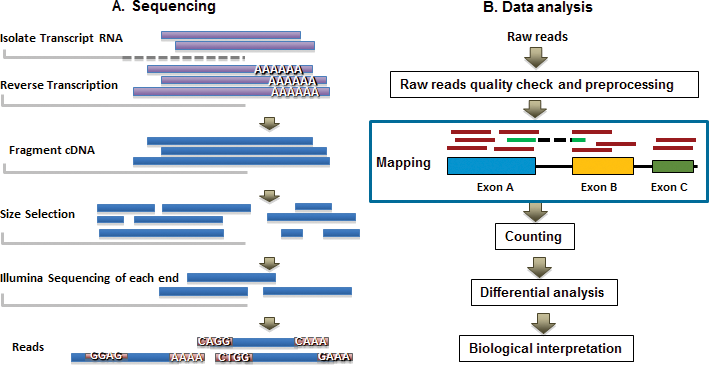
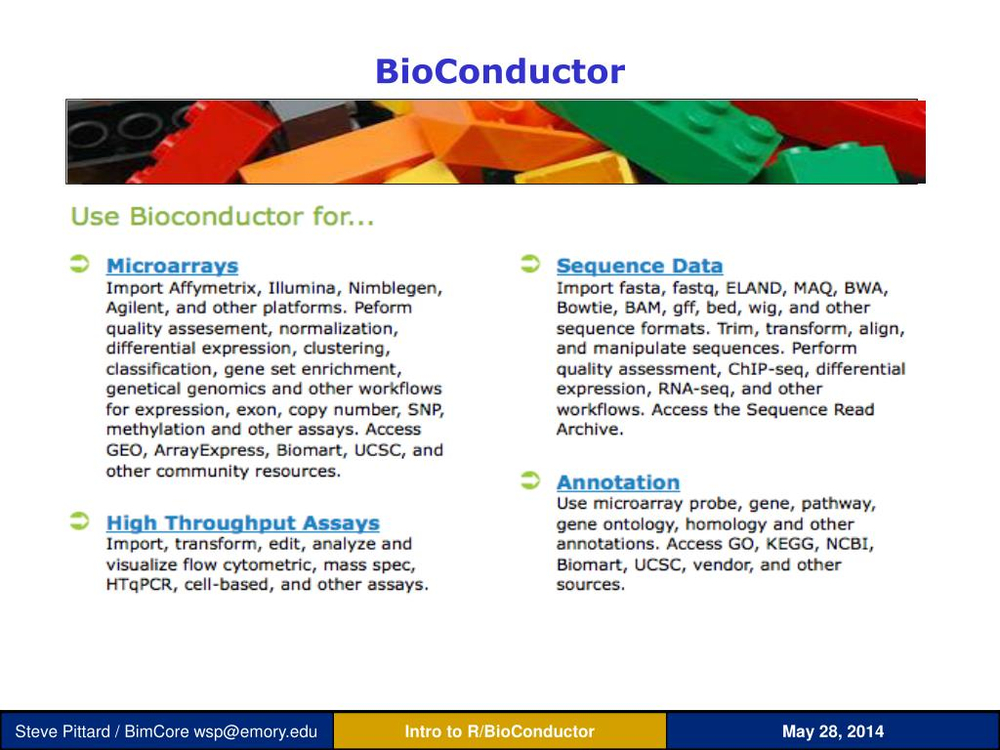
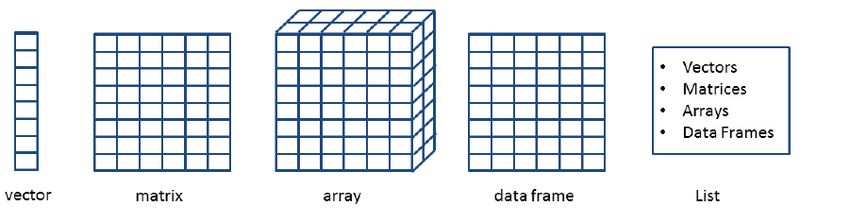
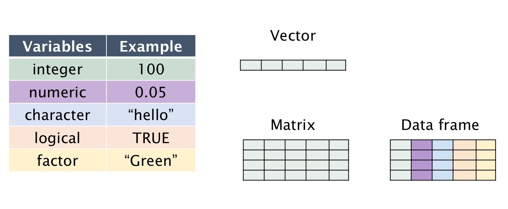
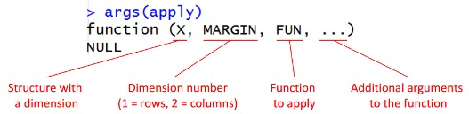
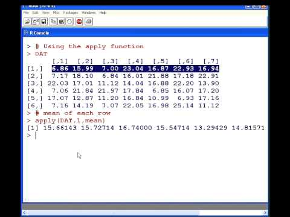

# Introduction to R for Genomic Data Analysis

**Learning objectives:**

- Understand the general workflow of genomic analysis in R
- Comprehend differences between data structures and data types
- **Download and install R, RStudio, Bioconductor, compGenomRData**
- Reading and writing tables
- Construct plots in base R and/or ggplot
- Functions and loops

## Genomic data analysis (a high level view)-- in R!





## Getting started with R and Bioconductor

Install R and RStudio if you haven't done so already (see resources)

Install Bioconductor 
```{r eval=FALSE} 
install.packages("BiocManager")
```
https://www.bioconductor.org/install/

Installing Bioconductor packages
```{r eval = FALSE}
BiocManager::install("xyzpackage")
```

Installing packages from Github
```{r eval=FALSE}
library(devtools)
devtools::install_github("compgenomr/compGenomRData")
```

## Data stuctures and data types

Data Structures


Data types


## Reading and writing data
First download the `compGenomRData` package from Github if you haven't done so yet.
We are using this as a companion for the course!

```{r eval=FALSE}
devtools::install_github("compgenomr/compGenomRData")
```

Read files in base R
```{r}
cpgiFilePath=system.file("extdata",
                "subset.cpgi.hg18.bed",
                package="compGenomRData")

# read CpG island BED file
cpgi.df <- read.table(cpgiFilePath, header = FALSE) 
```

```{r}
enhancerFilePath=system.file("extdata",
                "subset.enhancers.hg18.bed",
                package="compGenomRData")

# read enhancer marker BED file
enh.df <- read.table(enhancerFilePath, header = FALSE) 

# check first lines to see how the data looks like
head(enh.df)
```
the key here is 
```{r eval = FALSE}
read.table()
```

Reading large tables with `readr`.
```{r}
library(readr)
df.f2=read_table(enhancerFilePath, col_names = FALSE)
df.f2
```

Readr is part of the tidyverse (tidyverse is life).

Writing data w/ `write.table`
```{r eval = FALSE}
write.table(enh.df,file="enh.txt",quote=FALSE,
            row.names=FALSE,col.names=FALSE,sep="\t")
```
- The type of file it is save as depends on the sep (^ saved a tab separated file or .tsv)

Saving/loading R objects directly into/from a file
```{r eval = FALSE}
# save() saves many objects at once, regardless of class
save(cpgi.df,enh.df,file="mydata.RData")
load("mydata.RData")
```

```{r eval = FALSE}
# saveRDS() can save one object at a type
saveRDS(cpgi.df,file="cpgi.rds")
x=readRDS("cpgi.rds")
head(x)
# when using saveRDS() must assign output of readRDS() to new variable in session
```


## Plots: Base R vs ggplot
[A great comparison of the two systems!](https://flowingdata.com/2016/03/22/comparing-ggplot2-and-r-base-graphics)

ggplot: "The basic idea is that you can split a chart into graphical objects — data, scale, coordinate system, and annotation — and think about them separately. When you put it all together, you get a complete chart."

base: "specify everything in the function arguments"

## Functions and Loops

Components of a basic function
```{r}
my_function <-function(x,y){ # create function as object (my_function <- function()) 
                             # define inputs of function (function(x,y))
                             # function is written between {} brackets
result=x^2+y^2               # what your function does with inputs
return(result)               # return() gives the result as the output
}
                         
my_function(2,3)              # now try the function out
```

A function with conditions
```{r error = TRUE}

largeCpGi<-function(bedRow){      # function takes input one row of CpGi data frame 
                                  # generated earlier under "Read files in base R"
 cpglen=bedRow[3]-bedRow[2]+1     # subtract column 3 value from column 2 value + 1
 if(cpglen>1500){                 # if the result (cpglen) meets this parameter                                         # (is larger than 1500)
    cat("this is large\n")        # cat[used in place of print/return] "this is                                         # large\n" --> the \n means print a new line
 }
 else if(cpglen<=1500 & cpglen>700){           # else if -- if the above was not true,                                                # see if result meets these parameters
    cat("this is normal\n")
 }
 else{                            # if the result did not meet previous parameters
    cat("this is short\n")        
 }
}
largeCpGi(cpgi.df[10,])           # function to take 10th row of data frame 
largeCpGi(cpgi.df[10])            # what happens if you input this instead?
largeCpGi(cpgi.df(10))            # or this?
```

Loops to repeat a function multiple times
```{r}
result=c() # this is where we will keep the lengths. for now it is an empty vector.

for(i in 1:100){                      # start a loop to iterate 100 times
    len=cpgi.df[i,3]-cpgi.df[i,2]+1   # to calculate the length of each cpgi
                                      # where i is each row of the data frame cpgi.df
    result=c(result,len)              # append the length to the result each time
}

result                                # check the result
```
Loops are not always the most efficient way to work in R. 
We can use special functions to perform loops. 

In base R: the `apply` family


`lapply` applies a function to a single list or vector
`mapply` is like `lapply` but over multiple vectors/lists

vectorized function can be summed (`+`, `rowSums`, `colSums`)

In the tidyverse: `purrr` --> specifically `map`


## Resources

- R and R Studio
  - [R](https://www.r-project.org/)
  - [R Studio](https://www.rstudio.com/products/rstudio/download/)
  
- [Bioconductor](https://www.bioconductor.org/)
- [Tidyverse](https://www.tidyverse.org/)
- [apply functions](https://www.guru99.com/r-apply-sapply-tapply.html)
- [purr and map](https://www.rebeccabarter.com/blog/2019-08-19_purrr/)


## Meeting Videos

### Cohort 1

`r knitr::include_url("https://www.youtube.com/embed/URL")`

<details>
<summary> Meeting chat log </summary>

```
LOG
```
</details>
