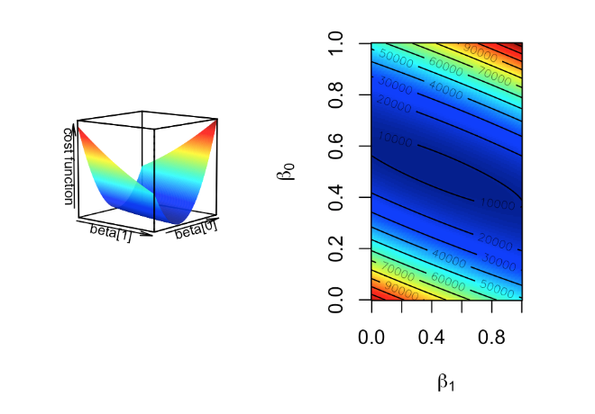
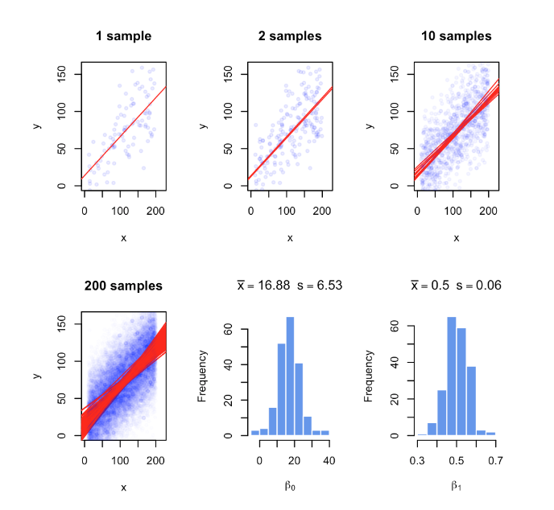
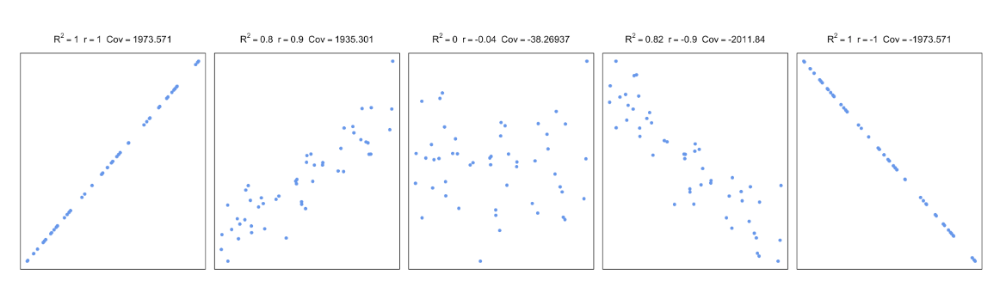

# Statistics for Genomics

**Learning objectives:**

- understand your data
- apply statistical methods for analyzing it
- test differences


## Introduction

In this chapter we will see some statistical techniques that are used for analyzing data, in particular for genomics data. 
We will have a look at the descriptive statistics and more common distributions. 
Finally, we will attempt at answering some questions, and in order to do that, we will use regression re-sampling methods.

To conclude, we will discuss about the possible approaches for best estimation and make some metrics both for regression and classification models.


## How to summarize collection of data points: The idea behind statistical distributions

### Measuring the measuring central tendency

- mean
- median: not affected by outliers

### Measurements of variation

- range
- standard deviation
- variance: affected by outliers
- adj variance
- percentiles: difference between 75th percentile and 25th percentile removes potential outliers

### Statistical distributions

probability of occurrence

- normal distribution or Gaussian distribution: typical “bell-curve” 


### Confidence intervals


- bootstrap resampling or bootstrapping: estimate intervals is to repeatedly take samples from the original sample with replacement.
```{r 03-1, message=FALSE, warning=FALSE, paged.print=FALSE}
library(mosaic)
set.seed(21)
sample1= rnorm(50,20,5) # simulate a sample

# do bootstrap resampling, sampling with replacement
boot.means=do(1000) * mean(resample(sample1))

# get percentiles from the bootstrap means
q=quantile(boot.means[,1],p=c(0.025,0.975))

# plot the histogram
hist(boot.means[,1],col="cornflowerblue",border="white",
                    xlab="sample means")
abline(v=c(q[1], q[2] ),col="red")
text(x=q[1],y=200,round(q[1],3),adj=c(1,0))
text(x=q[2],y=200,round(q[2],3),adj=c(0,0))
```

- Central Limit Theorem(CLT): construct the confidence interval using standard normal distribution, take repeated samples from a population with sample size, the distribution of means of those samples will be approximately normal with mean and standard deviation.

## How to test for differences between samples


Variability in our measurements
healthy samples are different from disease samples in some measurable feature (blood count, gene expression, methylation of certain loci).


1. subtract the means of two samples
2. hypothesis testing

> "we can compare the real difference and measure how unlikely it is to get such a value under the expectation of the null hypothesis"

### Randomization

```{r 03-2}
set.seed(100)
gene1=rnorm(30,mean=4,sd=2)
gene2=rnorm(30,mean=2,sd=2)
org.diff=mean(gene1)-mean(gene2)
gene.df=data.frame(exp=c(gene1,gene2),
                  group=c( rep("test",30),rep("control",30) ) )


exp.null <- do(1000) * diff(mosaic::mean(exp ~ shuffle(group), data=gene.df))
hist(exp.null[,1],xlab="null distribution | no difference in samples",
     main=expression(paste(H[0]," :no difference in means") ),
     xlim=c(-2,2),col="cornflowerblue",border="white")
abline(v=quantile(exp.null[,1],0.95),col="red" )
abline(v=org.diff,col="blue" )
text(x=quantile(exp.null[,1],0.95),y=200,"0.05",adj=c(1,0),col="red")
text(x=org.diff,y=200,"org. diff.",adj=c(1,0),col="blue")
```

```{r 03-3}
p.val=sum(exp.null[,1]>org.diff)/length(exp.null[,1])
p.val
```


### t-test

```{r 03-4}
# Welch's t-test
stats::t.test(gene1,gene2)
```


```{r 03-5}
# t-test with equal variance assumption
stats::t.test(gene1,gene2,var.equal=TRUE)
```


### Multiple testing


```{r 03-6}
# BiocManager::install("qvalue")
library(qvalue)
data(hedenfalk)

qvalues <- qvalue(hedenfalk$p)$q
bonf.pval=p.adjust(hedenfalk$p,method ="bonferroni")
fdr.adj.pval=p.adjust(hedenfalk$p,method ="fdr")

plot(hedenfalk$p,qvalues,pch=19,ylim=c(0,1),
     xlab="raw P-values",ylab="adjusted P-values")
points(hedenfalk$p,bonf.pval,pch=19,col="red")
points(hedenfalk$p,fdr.adj.pval,pch=19,col="blue")
legend("bottomright",legend=c("q-value","FDR (BH)","Bonferroni"),
       fill=c("black","blue","red"))
```


### Moderated t-tests

For example, if you have many variances calculated for thousands of genes across samples, you can force individual variance estimates to shrink toward the mean or the median of the distribution of variances. 


**How much the values are shrunk toward a common value depends on the exact method used. These tests in general are called moderated t-tests or shrinkage t-tests.**

1. One approach popularized by Limma software is to use so-called “Empirical Bayes methods”. The main formulation in these methods is 

$$\hat{V_g}=aV_0+bV_g$$

$$V_0=\text{background variability (the prior)}$$
$$V_g=\text{is the individual variability}$$


$$\hat{V_g}=\text{“shrunk” version of the variability.}$$


is the background variability and  is the individual variability. Then, these methods estimate  and  in various ways to come up with a “shrunk” version of the variability. Bayesian inference can make use of prior knowledge to make inference about properties of the data. In a Bayesian viewpoint, the prior knowledge, in this case variability of other genes, can be used to calculate the variability of an individual gene. In our case, would be the prior knowledge we have on the variability of the genes and we use that knowledge to influence our estimate for the individual genes.

```{r 03-7, message=FALSE, warning=FALSE, paged.print=FALSE}
set.seed(100)

#sample data matrix from normal distribution

gset=rnorm(3000,mean=200,sd=70)
data=matrix(gset,ncol=6)

# set groups
group1=1:3
group2=4:6
n1=3
n2=3
dx=rowMeans(data[,group1])-rowMeans(data[,group2])
  
require(matrixStats)

# get the estimate of pooled variance 
stderr = sqrt( (rowVars(data[,group1])*(n1-1) + 
       rowVars(data[,group2])*(n2-1)) / (n1+n2-2) * ( 1/n1 + 1/n2 ))

# do the shrinking towards median
mod.stderr = (stderr + median(stderr)) / 2 # moderation in variation

# estimate t statistic with moderated variance
t.mod <- dx / mod.stderr

# calculate P-value of rejecting null 
p.mod = 2*pt( -abs(t.mod), n1+n2-2 )

# estimate t statistic without moderated variance
t = dx / stderr

# calculate P-value of rejecting null 
p = 2*pt( -abs(t), n1+n2-2 )

par(mfrow=c(1,2))
hist(p,col="cornflowerblue",border="white",main="",xlab="P-values t-test")
mtext(paste("signifcant tests:",sum(p<0.05))  )
hist(p.mod,col="cornflowerblue",border="white",main="",
     xlab="P-values mod. t-test")
mtext(paste("signifcant tests:",sum(p.mod<0.05))  )
```


## Relationship between variables: Linear models and correlation

Examples:

1. want to know about expression of a particular gene in liver in relation to the dosage of a drug that patient receives
2. DNA methylation of a certain locus in the genome in relation to the age of the sample donor. 
3. relationship between histone modifications and gene expression.


$$Y=\beta_0+\beta_1X+\epsilon$$
Approximation of the **response**:

$$Y\sim\beta_0+\beta_1X$$
Estimation of the coefficients:

$$Y=\hat{\beta_0}+\hat{\beta_1}X$$

More than one predictor:

$$Y=\beta_0+\beta_1X_1+\beta_2X_2+\epsilon$$
$$Y=\beta_0+\beta_1X_1+\beta_2X_2+\beta_3X_3+...+\beta_nX_n+\epsilon$$

<br>

$$Y=\begin{bmatrix}
1 & X_{1,1} & X_{1,2}\\ 
1 & X_{2,1} & X_{2,2}\\ 
1 & X_{3,1} & X_{3,2}\\ 
1 & X_{4,1} & X_{4,2}
\end{bmatrix}\begin{bmatrix}
\beta_0 \\ 
\beta_1 \\ 
\beta_2 
\end{bmatrix}+\begin{bmatrix}
\epsilon_1 \\ 
\epsilon_2 \\ 
\epsilon_3\\
\epsilon_0
\end{bmatrix}$$

<br>

$$Y_1=\beta_0+\beta_1X_{1,1}+\beta_2X_{1,2}+\epsilon_1$$
$$Y_1=\beta_0+\beta_1X_{2,1}+\beta_2X_{2,2}+\epsilon_2$$
$$Y_1=\beta_0+\beta_1X_{3,1}+\beta_2X_{3,2}+\epsilon_3$$
$$Y_1=\beta_0+\beta_1X_{4,1}+\beta_2X_{4,2}+\epsilon_4$$
<br>

$$Y=X\beta+\epsilon$$

### The cost or loss function approach


Minimize the residuals: optimization procedure

$$min\sum{(y_i=(\beta_0+\beta_1x_1))^2}$$


**The “gradient descent” algorithm"**

1. Pick a random starting point, random $\beta$ values.

2. Take the partial derivatives of the cost function to see which direction is the way to go in the cost function.

3. Take a step toward the direction that minimizes the cost function.
   - Step size is a parameter to choose, there are many variants.
    
4. Repeat step 2,3 until convergence.


**The algorithm usually converges to optimum $\beta$ values.**

```{r 03-8, fig.cap="Cost function landscape for linear regression with changing beta values. The optimization process tries to find the lowest point in this landscape by implementing a strategy for updating beta values toward the lowest point in the landscape.", echo=FALSE, fig.align='center'}

```


### The “maximum likelihood” approach

- The response variable $y_i$ follows a normal distribution with mean $\beta_0+\beta_1x_i$ and variance $s^2$.
- Find $\beta_0$ and $\beta_1$ that maximizes the probability of observing all the response variables in the dataset given the explanatory variables.

- constant variance $s^2$, estimation of the variance of the population $\sigma^2$

$$s^2=\frac{\sum{\epsilon_i}}{n-2}$$
Probability:

$$P(y_i)=\frac{1}{s\sqrt{2\pi}}e^{-\frac{1}{2}(\frac{y_i-(\beta_0+\beta_1x_i)}{s})^2}$$

Likelihood function:

$$L=P(y_1)P(y_2)P(y_3)..P(y_n)=\prod_{i=1}^{n}{P_i}$$


The log:

$$ln(L)=-nln(s\sqrt{2\pi})-\frac{1}{2s^2}\sum_{i=1}{n}{(y_i-(\beta_0+\beta_1x_i))^2}$$
the negative of the cost function:
$$-\frac{1}{2s^2}\sum_{i=1}{n}{(y_i-(\beta_0+\beta_1x_i))^2}$$
to optimize this function we would need to take the derivative of the function with respect to the parameters.
  

### Linear algebra and closed-form solution to linear regression

$$\epsilon_i=Y_i-(\beta_0+\beta_1x_i)$$
<br>

$$\sum{\epsilon_i^2}=\epsilon^T\epsilon=(Y-\beta X)^T(Y-\beta X)$$
$$= Y^TY-(2\beta^T Y + \beta^T X^T X\beta)$$
<br>

$$\hat{\beta}=(X^T X)^{-1}X^T Y$$

$$\hat{\beta_1}=\frac{\sum{(x_i-\bar{X})(y_i-\bar{Y})}}{\sum{(x_i-\bar{X})^2}}$$

$$\hat{\beta_0}=\bar{Y}-\hat{\beta_1}\bar{X}$$
```{r 03-9}
# set random number seed, so that the random numbers from the text
# is the same when you run the code.
set.seed(32)

# get 50 X values between 1 and 100
x = runif(50,1,100)

# set b0,b1 and variance (sigma)
b0 = 10
b1 = 2
sigma = 20
# simulate error terms from normal distribution
eps = rnorm(50,0,sigma)
# get y values from the linear equation and addition of error terms
y = b0 + b1*x+ eps
```
  
  
```{r 03-10}
mod1=lm(y~x)

# plot the data points
plot(x,y,pch=20,
     ylab="Gene Expression",xlab="Histone modification score")
# plot the linear fit
abline(mod1,col="blue")
```
  
  
### How to estimate the error of the coefficients

```{r 03-11, fig.cap="Regression coefficients vary with every random sample. The figure illustrates the variability of regression coefficients when regression is done using a sample of data points. Histograms depict this variability for b0 and b1 coefficients.", echo=FALSE, fig.align='center'}

```

The calculation of the **Residual Standard Error (RSE)** 

$$s=RSE$$


```{r 03-12}
mod1=lm(y~x)
summary(mod1)
```

```{r 03-13}
# get confidence intervals 
confint(mod1)
```
  
  
```{r 03-14}
# pull out coefficients from the model
coef(mod1)
```
  
  
### Accuracy of the model

$$s=RSE=\sqrt{\frac{\sum{(y_i-\hat{Y_i})^2}}{n-p}}=\sqrt{\frac{RSS}{n-p}}$$

<br>

$$R^2=1-\frac{RSS}{TSS}=\frac{TSS-RSS}{TSS}=1-\frac{RSS}{TSS}$$

<br>

$$r_{xy}=\frac{cov(X,Y)}{\sigma_x\sigma_y}=\frac{\sum_{i=1}^n{(x_i-\bar{x})(y_i-\bar{y})}}{\sqrt{\sum_{i=1}^n{(x_i-\bar{x})^2\sum_{i=1}^n{(y_i-\bar{y})^2}}}}$$

```{r 03-15, fig.cap="Correlation and covariance for different scatter plots.", echo=FALSE, fig.align='center'}

```


$$H_0:\beta_1=\beta_2=\beta_3=...=\beta_p=0$$

$$H_1:\text{at least one}\beta_1\neq0$$

**The F-statistic for a linear model**

$$F=\frac{(TSS-RSS)/(p-1)}{RSS/(n-p)}=\frac{(TSS-RSS)/(p-1)}{RSE}\sim{F(p-1,n-p)}$$


### Regression with categorical variables

```{r 03-16}
set.seed(100)
gene1=rnorm(30,mean=4,sd=2)
gene2=rnorm(30,mean=2,sd=2)
gene.df=data.frame(exp=c(gene1,gene2),
                  group=c( rep(1,30),rep(0,30) ) )

mod2=lm(exp~group,data=gene.df)
summary(mod2)
```
  
  
```{r 03-17}
require(mosaic)
plotModel(mod2)
```
  
  
```{r 03-18}
gene.df=data.frame(exp=c(gene1,gene2,gene2),
                  group=c( rep("A",30),rep("B",30),rep("C",30) ) 
                  )

mod3=lm(exp~group,data=gene.df)
summary(mod3)
```
  
  
### Regression pitfalls


- Non-linearity
- Correlation of explanatory variables
- Correlation of error terms
- Non-constant variance of error terms
- Outliers and high leverage points


## Meeting Videos

### Cohort 1

`r knitr::include_url("https://www.youtube.com/embed/URL")`

<details>
<summary> Meeting chat log </summary>

```
LOG
```
</details>
