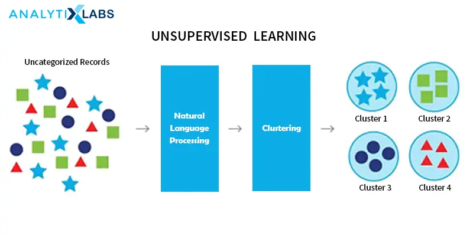

# Predictive Modeling with Supervised Machine Learning

**Learning objectives:**

- THESE ARE NICE TO HAVE BUT NOT ABSOLUTELY NECESSARY

## 5.1 and 5.2





## 5.3 Example Case (Prep)

```{r}
# get file paths
fileLGGexp=system.file("extdata",
                      "LGGrnaseq.rds",
                      package="compGenomRData")
fileLGGann=system.file("extdata",
                      "patient2LGGsubtypes.rds",
                      package="compGenomRData")
# gene expression values
gexp=readRDS(fileLGGexp)
head(gexp[,1:5])

dim(gexp)

# patient annotation
patient=readRDS(fileLGGann)
head(patient)

dim(patient)

#caret for pre-processing

library(caret)
```

## 5.4 Data pre-processing

**Transform** --> filter/scale --> handle missing values 
```{r}

#some of the un-transformed data
boxplot(gexp[,1:50],outline=FALSE,col="cornflowerblue")

#looks a little funny... let's see what happens when we log transform it. 

par(mfrow=c(1,2))

##not transformed
hist(gexp[,5],xlab="gene expression",main="",border="blue4",
     col="cornflowerblue") 

#log transformed
hist(log10(gexp+1)[,5], xlab="gene expression log scale",main="",
     border="blue4",col="cornflowerblue")

# transpose data so predictor variables are on column side  
tgexp <-t(gexp)
```

Transform --> **filter/scale** --> handle missing values 

Remove near zero variation for the columns at least b/c likely not to have predictive value
```{r}
library(caret)

# 85% of the values are the same
# this function creates the filter but doesn't apply it yet
nzv=preProcess(tgexp,method="nzv",uniqueCut = 15)

# apply the filter using "predict" function
# return the filtered dataset and assign it to nzv_tgexp variable
nzv_tgexp=predict(nzv,tgexp)

```

How many variable predictors? This can be arbitrary
```{r}
SDs=apply(tgexp,2,sd )
topPreds=order(SDs,decreasing = TRUE)[1:1000]
tgexp=tgexp[,topPreds]
```

What about centering and scaling the data?
```{r}
processCenter=preProcess(tgexp, method = c("center"))
tgexp=predict(processCenter,tgexp)
```

Filter out highly correlated variables so the model is fitted faster (optional depending on the type of analysis)
```{r}
corrFilt=preProcess(tgexp, method = "corr",cutoff = 0.9)
tgexp=predict(corrFilt,tgexp)
```

Transform --> filter/scale --> **handle missing values**

NA is NOT ZERO!!

Options for dealing with missing values ... it depends. 
-Discard samples and/or predictors with missing values
-Impute missing values via algorithm

```{r}
#add an NA to the dataset
missing_tgexp=tgexp
missing_tgexp[1,1]=NA

#remove from data set
gexpnoNA=missing_tgexp[ , colSums(is.na(missing_tgexp)) == 0]

#impute missing value w/ caret::preProcess
mImpute=preProcess(missing_tgexp,method="medianImpute")
imputedGexp=predict(mImpute,missing_tgexp)

#another, possibly more accurate imputation via nearest neighbors
library(RANN)
knnImpute=preProcess(missing_tgexp,method="knnImpute")
knnimputedGexp=predict(knnImpute,missing_tgexp) 
```

## 5.5 Split the data

"Gold standard" is to split 30% of data as test data, the other 70% 
```{r}
tgexp=merge(patient,tgexp,by="row.names")

# push sample ids back to the row names
rownames(tgexp)=tgexp[,1]
tgexp=tgexp[,-1]

set.seed(3031) # set the random number seed for reproducibility 

# get indices for 70% of the data set
intrain <- createDataPartition(y = tgexp[,1], p= 0.7)[[1]]

# separate test and training sets
training <- tgexp[intrain,]
testing <- tgexp[-intrain,]
```

## 5.6 Some unsupervised learning on training data to initially cluster data

Any way you want... k-nearest neighbors is often a good choice.
It's up to you to determine how your data best make sense to group together. 

```{r}
library(caret)
knnFit=knn3(x=training[,-1], # training set
            y=training[,1], # training set class labels
            k=5)
# predictions on the test set (which is also the training set in this case)
trainPred=predict(knnFit,training[,-1])
```

## 5.7

## 5.8

## Meeting Videos

### Cohort 1

`r knitr::include_url("https://www.youtube.com/embed/URL")`

<details>
<summary> Meeting chat log </summary>

```
LOG
```
</details>
