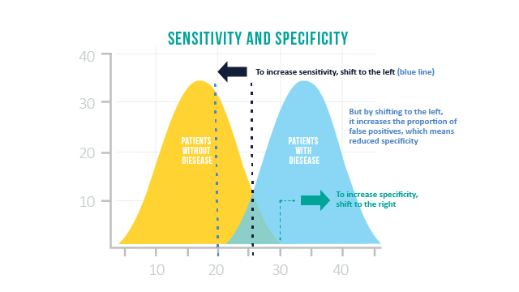

# Predictive Modeling with Supervised Machine Learning

**Learning objectives:**

- Cleaning and preparing data for supervised learning; splitting data set
- Perform unsupervised learning to cluster data
- Supervised learning

## Types of Learning and Chapter Code Preparation


```{r,warning = FALSE}

# get file paths
fileLGGexp=system.file("extdata",
                      "LGGrnaseq.rds",
                      package="compGenomRData")
fileLGGann=system.file("extdata",
                      "patient2LGGsubtypes.rds",
                      package="compGenomRData")
# gene expression values
gexp=readRDS(fileLGGexp)

head(gexp[,1:5])

dim(gexp)

# patient annotation
patient=readRDS(fileLGGann)
head(patient)

dim(patient)

```

## Data pre-processing

**Transform** --> filter/scale --> handle missing values 
```{r, message = FALSE}

#caret for pre-processing

library(caret)

#some of the un-transformed data
boxplot(gexp[,1:50],outline=FALSE,col="cornflowerblue")

#looks a little funny... let's see what happens when we log transform it. 

par(mfrow=c(1,2))

##not transformed
hist(gexp[,5],xlab="gene expression",main="",border="blue4",
     col="cornflowerblue") 

#log transformed
hist(log10(gexp+1)[,5], xlab="gene expression log scale",main="",
     border="blue4",col="cornflowerblue")

# transpose data so predictor variables are on column side  
tgexp <-t(gexp)
```

Transform --> **filter/scale** --> handle missing values 

Remove near zero variation for the columns at least b/c likely not to have predictive value
```{r}
library(caret)

# 85% of the values are the same
# this function creates the filter but doesn't apply it yet
nzv=preProcess(tgexp,method="nzv",uniqueCut = 15)

# apply the filter using "predict" function
# return the filtered dataset and assign it to nzv_tgexp variable
nzv_tgexp=predict(nzv,tgexp)

```

How many variable predictors? This can be arbitrary
```{r}
SDs=apply(tgexp,2,sd )
topPreds=order(SDs,decreasing = TRUE)[1:1000]
tgexp=tgexp[,topPreds]
```

What about centering and scaling the data?
```{r}
processCenter=caret::preProcess(tgexp, method = c("center"))
tgexp=predict(processCenter,tgexp)
```

Filter out highly correlated variables so the model is fitted faster (optional depending on the type of analysis)
```{r}
corrFilt=caret::preProcess(tgexp, method = "corr",cutoff = 0.9)
tgexp=predict(corrFilt,tgexp)
```

Transform --> filter/scale --> **handle missing values**

NA is NOT ZERO!!

Options for dealing with missing values ... it depends. 
-Discard samples and/or predictors with missing values
-Impute missing values via algorithm

```{r, warning = FALSE}

#add an NA to the dataset
missing_tgexp=tgexp
missing_tgexp[1,1]=NA

#remove from data set
gexpnoNA=missing_tgexp[,colSums(is.na(missing_tgexp)) == 0]

#impute missing value w/ caret::preProcess
library(caret)
mImpute=preProcess(missing_tgexp,method="medianImpute")
imputedGexp=predict(mImpute,missing_tgexp)

#another, possibly more accurate imputation via nearest neighbors
library(RANN)
knnImpute=preProcess(missing_tgexp,method="knnImpute")
knnimputedGexp=predict(knnImpute,missing_tgexp) 
```

## Split the data

"Gold standard" is to split 30% of data as test data, the other 70% 
```{r}
tgexp=merge(patient,tgexp,by="row.names")

# push sample ids back to the row names
rownames(tgexp)=tgexp[,1]
tgexp=tgexp[,-1]

set.seed(3031) # set the random number seed for reproducibility 

# get indices for 70% of the data set
intrain <- createDataPartition(y = tgexp[,1], p= 0.7)[[1]]

# separate test and training sets
training <- tgexp[intrain,]
testing <- tgexp[-intrain,]
```

## Some unsupervised learning on training data to initially cluster data

Any way you want... k-nearest neighbors is often a good choice.
It's up to you to determine how your data best make sense to group together. 

```{r}
library(caret)
knnFit=knn3(x=training[,-1], # training set
            y=training[,1], # training set class labels
            k=5)
# predictions on the test set (which is also the training set in this case)
trainPred=predict(knnFit,training[,-1])
```

## Precision, Specificity, and Sensitivity



```{r}
# get k-NN prediction on the training data itself, with k=5
knnFit=knn3(x=training[,-1], # training set
            y=training[,1], # training set class labels
            k=5)

# predictions on the training set
trainPred=predict(knnFit,training[,-1],type="class")

# compare the predicted labels to real labels
# get different performance metrics
confusionMatrix(data=training[,1],reference=trainPred)
```

```{r}
# predictions on the test set, return class labels
testPred=predict(knnFit,testing[,-1],type="class")

# compare the predicted labels to real labels
# get different performance metrics
confusionMatrix(data=testing[,1],reference=testPred)
```

```{r}
library(pROC)

# get k-NN class probabilities
# prediction probabilities on the test set
testProbs=predict(knnFit,testing[,-1])

# get the roc curve
rocCurve <- pROC::roc(response = testing[,1],
                predictor = testProbs[,1],
              ## This function assumes that the second
              ## class is the class of interest, so we
              ## reverse the labels.
              levels = rev(levels(testing[,1])))
# plot the curve
plot(rocCurve, legacy.axes = TRUE)

# return area under the curve
pROC::auc(rocCurve)

```


## Actual prediciting k (model tuning)

```{r}

## PREDICT K ON TRAINING DATA

set.seed(101)
k=1:12 # set k values 
trainErr=c() # set vector for training errors
for( i in k){
  
  knnFit=knn3(x=training[,-1], # training set
              y=training[,1], # training set class labels
              k=i)

  # predictions on the training set
  class.res=predict(knnFit,training[,-1],type="class")

  # training error
  err=1-confusionMatrix(training[,1],class.res)$overall[1]
  trainErr[i]=err
}

# plot training error vs k
plot(k,trainErr,type="p",col="#CC0000",pch=20)

# add a smooth line for the trend
lines(loess.smooth(x=k, trainErr,degree=2),col="#CC0000")
```

```{r}
set.seed(31)
k=1:12
testErr=c()
for( i in k){

  knnFit=knn3(x=training[,-1], # training set
              y=training[,1], # training set class labels
              k=i)

  # predictions on the training set
  class.res=predict(knnFit,testing[,-1],type="class")
  testErr[i]=1-confusionMatrix(testing[,1],
                                 class.res)$overall[1]
 
}

# plot training error
plot(k,trainErr,type="p",col="#CC0000",
     ylim=c(0.000,0.08),
     ylab="prediction error (1-accuracy)",pch=19)
# add a smooth line for the trend
lines(loess.smooth(x=k, trainErr,degree=2), col="#CC0000")

# plot test error
points(k,testErr,col="#00CC66",pch=19) 
lines(loess.smooth(x=k,testErr,degree=2), col="#00CC66")
# add legend
legend("bottomright",fill=c("#CC0000","#00CC66"),
       legend=c("training","test"),bty="n")
```

Want to have the happy medium between model complexity and prediction error...


```{r}
set.seed(17)
# this method controls everything about training
# we will just set up 10-fold cross validation
trctrl <- trainControl(method = "cv",number=10)

# we will now train k-NN model
knn_fit <- train(subtype~., data = training, 
                 method = "knn",
                 trControl=trctrl,
                 tuneGrid = data.frame(k=1:12))

# best k value by cross-validation accuracy
knn_fit$bestTune

# plot k vs prediction error
plot(x=1:12,1-knn_fit$results[,2],pch=19,
     ylab="prediction error",xlab="k")
lines(loess.smooth(x=1:12,1-knn_fit$results[,2],degree=2),
      col="#CC0000")
```

Another strategy for model tuning: Permutation of variables in the test phase -- which variables are important?
```{r, eval = FALSE}
library(DALEX)
set.seed(102)
# do permutation drop-out
explainer_knn<- DALEX::explain(knn_fit, 
                               label="knn", 
                               data =training[,-1], 
                               y = as.numeric(training[,1]))

viknn=feature_importance(explainer_knn,n_sample=50,type="difference")
plot(viknn[1:8,])
```


## Supervised algorithm #1: Random forest

"A (random) forest filled with decision trees"


```{r}
set.seed(17)

# we will do no resampling based prediction error
# although it is advised to do so even for random forests
trctrl <- trainControl(method = "none")

# we will now train random forest model
rfFit <- train(subtype~., 
               data = training, 
               method = "ranger",
               trControl=trctrl,
               importance="permutation", # calculate importance
               tuneGrid = data.frame(mtry=100,
                                     min.node.size = 1,
                                     splitrule="gini")
               )
# print OOB error
rfFit$finalModel$prediction.error

# plot of most important variables

plot(varImp(rfFit),top=10)
```

## Supervised Algorithm #2: Logistic Regression and Regularization

```{r, warning = FALSE}
# fit logistic regression model
# method and family defines the type of regression
# in this case these arguments mean that we are doing logistic
# regression
lrFit = train(subtype ~ PDPN,  
               data=training, trControl=trainControl("none"),
               method="glm", family="binomial")

# create data to plot the sigmoid curve
newdat <- data.frame(PDPN=seq(min(training$PDPN),
                               max(training$PDPN),len=100))

# predict probabilities for the simulated data
newdat$subtype = predict(lrFit, newdata=newdat, type="prob")[,1]

# plot the sigmoid curve and the training data
plot(ifelse(subtype=="CIMP",1,0) ~ PDPN, 
     data=training, col="red4",
     ylab="subtype as 0 or 1", xlab="PDPN expression")
lines(subtype ~ PDPN, newdat, col="green4", lwd=2)

# training accuracy 
class.res=predict(lrFit,training[,-1])
confusionMatrix(training[,1],class.res)$overall[1]

# test accuracy 
class.res=predict(lrFit,testing[,-1])
confusionMatrix(testing[,1],class.res)$overall[1]
```

What if we didn't train the model?
```{r, warning = FALSE}
lrFit2 = train(subtype ~ .,  
                data=training, 
                # no model tuning with sampling
                trControl=trainControl("none"),
                method="glm", family="binomial")

# training accuracy 
class.res=predict(lrFit2,training[,-1])
confusionMatrix(training[,1],class.res)$overall[1]

# test accuracy 
class.res=predict(lrFit2,testing[,-1])
confusionMatrix(testing[,1],class.res)$overall[1]
```

Decrease model variance by adding regularization. 
This limits the flexibility of the model. 

L2 norm = Sqrt of sum of squared vector values --> coefficients in regression closer to zero. 

Let's try this!

```{r}
set.seed(17)
library(glmnet)

# this method controls everything about training
# we will just set up 10-fold cross validation
trctrl <- trainControl(method = "cv",number=10)

# we will now train elastic net model
# it will try
enetFit <- train(subtype~., data = training, 
                 method = "glmnet",
                 trControl=trctrl,
                 # alpha and lambda paramters to try
                 tuneGrid = data.frame(alpha=0.5,
                                       lambda=seq(0.1,0.7,0.05)))

# best alpha and lambda values by cross-validation accuracy
enetFit$bestTune

# test accuracy 
class.res=predict(enetFit,testing[,-1])
confusionMatrix(testing[,1],class.res)$overall[1]

# most important variables
plot(varImp(enetFit),top=10)
```


## Other algorithms
 
Gradient boosting


```{r}
library(xgboost)
set.seed(17)

# we will just set up 5-fold cross validation
trctrl <- trainControl(method = "cv",number=5)

# we will now train elastic net model
# it will try
gbFit <- train(subtype~., data = training, 
                 method = "xgbTree",
                 trControl=trctrl,
                 # paramters to try
                 tuneGrid = data.frame(nrounds=200,
                                       eta=c(0.05,0.1,0.3),
                                       max_depth=4,
                                       gamma=0,
                                       colsample_bytree=1,
                                       subsample=0.5,
                                       min_child_weight=1))
                                       

# best parameters by cross-validation accuracy
gbFit
gbFit$bestTune
```
 
 
 Support Vector Machines
 
```{r}
library(kernlab)
set.seed(17)

# we will just set up 5-fold cross validation
trctrl <- trainControl(method = "cv",number=5)

# we will now train elastic net model
# it will try
svmFit <- train(subtype~., data = training, 
                # this SVM used radial basis function
                 method = "svmRadial", 
                 trControl=trctrl,
                tuneGrid=data.frame(C=c(0.25,0.5,1),
                                    sigma=1))
svmFit
svmFit$bestTune
```
 
 Neural Networks
 
```{r}

library(nnet)
set.seed(17)

# we will just set up 5-fold cross validation
trctrl <- trainControl(method = "cv",number=5)

# we will now train neural net model
# it will try
nnetFit <- train(subtype~., data = training, 
                 method = "nnet",
                 trControl=trctrl,
                 tuneGrid=data.frame(size=1:2,decay=0
                                      ),
                 # this is maximum number of weights
                 # needed for the nnet method
                 MaxNWts=2000) 

nnetFit
nnetFit$bestTune

```
 
 Ensemble Models
 
```{r}

# predict with k-NN model
knnPred=as.character(predict(knnFit,testing[,-1],type="class"))
# predict with elastic Net model
enetPred=as.character(predict(enetFit,testing[,-1]))
# predict with random forest model
rfPred=as.character(predict(rfFit,testing[,-1]))

# do voting for class labels
# code finds the most frequent class label per row
votingPred=apply(cbind(knnPred,enetPred,rfPred),1,
                 function(x) names(which.max(table(x))))

# check accuracy
confusionMatrix(data=testing[,1],
                reference=as.factor(votingPred))$overall[1]

```
 


## Prediciting continuous variables by regression

```{r}
# file path for CpG methylation and age
fileMethAge=system.file("extdata",
                      "CpGmeth2Age.rds",
                      package="compGenomRData")

# read methylation-age table
ameth=readRDS(fileMethAge)
dim(ameth)

summary(ameth[,1:3])

# plot histogram of methylation values
hist(unlist(ameth[,-1]),border="white",
      col="cornflowerblue",main="",xlab="methylation values")

# remove CpGs with less than 0.1 StDev

ameth=ameth[,c(TRUE,matrixStats::colSds(as.matrix(ameth[,-1]))>0.1)]
dim(ameth)

```

Running random forest regression
```{r}
set.seed(18)

par(mfrow=c(1,2))

# we are not going to do any cross-validation
# and rely on OOB error
trctrl <- trainControl(method = "none")

# we will now train random forest model
rfregFit <- train(Age~., 
               data = ameth, 
               method = "ranger",
               trControl=trctrl,
               # calculate importance
               importance="permutation", 
               tuneGrid = data.frame(mtry=50,
                                     min.node.size = 5,
                                     splitrule="variance")
               )
# plot Observed vs OOB predicted values from the model
plot(ameth$Age,rfregFit$finalModel$predictions,
     pch=19,xlab="observed Age",
     ylab="OOB predicted Age")
mtext(paste("R-squared",
            format(rfregFit$finalModel$r.squared,digits=2)))

# plot residuals
plot(ameth$Age,(rfregFit$finalModel$predictions-ameth$Age),
     pch=18,ylab="residuals (predicted-observed)",
     xlab="observed Age",col="blue3")
abline(h=0,col="red4",lty=2)
```


## Meeting Videos

### Cohort 1

`r knitr::include_url("https://www.youtube.com/embed/URL")`

<details>
<summary> Meeting chat log </summary>

```
LOG
```
</details>
