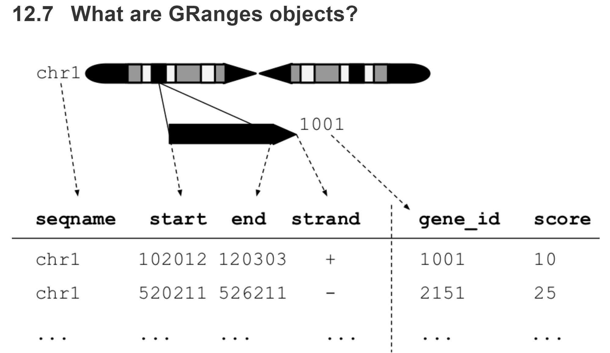
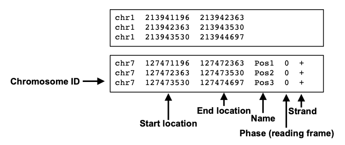
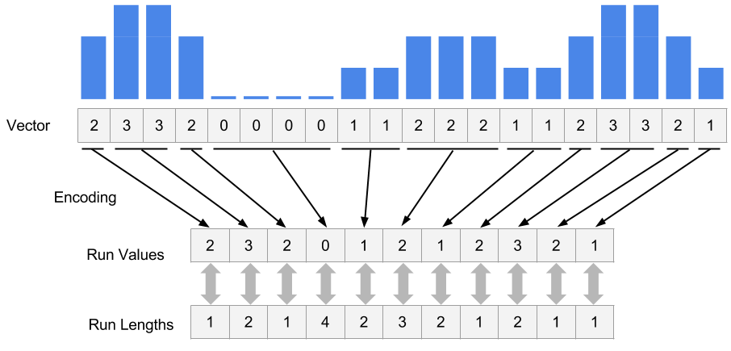
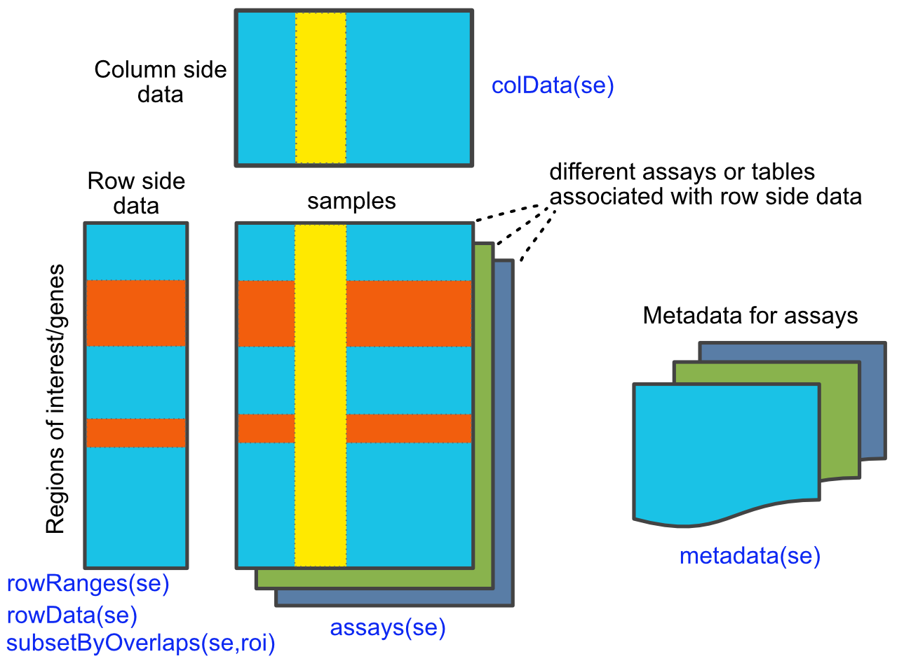

# Operations on Genomic Intervals and Genome Arithmetic

**Learning objectives:**

- Understand GRange Objects and manipulate them
- Importing common genomic data formats as GRange Objects
- Experimental Summary and Visualization 


## Genomic Ranges

### GRanges objects

[GenomicRanges Vignette](http://www.bioconductor.org/packages/release/bioc/vignettes/GenomicRanges/inst/doc/GenomicRangesIntroduction.html) 

[Helpful GenomicRanges Walkthrough](https://bioconductor.github.io/BiocWorkshops/fluent-genomic-data-analysis-with-plyranges.html)

[Tidy Manipulation of GRanges Objects](https://sa-lee.github.io/plyranges/index.html)

GRanges Object: data table like, can be manipulated like a data table for the most part



- Three Primary Components of a GRanges Object
  - SeqNames (vector)
  - Ranges (IRanges Object)
  - Strand (vector)
- Metadata 
  - Added as vectors, can be nearly anything (mcols)

``` {r}
knitr::opts_chunk$set(message = FALSE, warning = FALSE)

library(GenomicRanges)
gr=GRanges(seqnames=c("chr1","chr2","chr2"),
           ranges=IRanges(start=c(50,150,200),
                          end=c(100,200,300)),
           strand=c("+","-","-")
)
gr

# basic manipulations
start(gr)
end(gr)
width(gr)
range(gr)

# subset like a data frame
gr[1:2,]


# tidy way of manipulation with plyranges
library(plyranges)
df <- data.frame(seqnames = c("chr1", "chr2", "chr2", "chr1", "chr2"),
                 start = 50:54,
                 width = 5)
df$strand <- c("+", "+", "-", "-", "*")
grdf <- as_granges(df)

grdf %>%
  filter(strand == "-")
```


```{r}
mcols(gr)=DataFrame(name2=c("pax6","meis1","zic4"),
                    score2=c(1,2,3))
gr$name3 = c("A","C", "B")
gr
```

GRangeList -- multiple GRanges objects in a list

```{r, echo = TRUE, eval = TRUE}
gr1 <- GRanges(
    seqnames = "chr2",
    ranges = IRanges(103, 106),
    strand = "+",
    score = 5L, GC = 0.45)
gr2 <- GRanges(
    seqnames = c("chr1", "chr1"),
    ranges = IRanges(c(107, 113), width = 3),
    strand = c("+", "-"),
    score = 3:4, GC = c(0.3, 0.5))
grl <- GRangesList("txA" = gr1, "txB" = gr2)
grl
```


###  Getting genomic data into R as a table


```{r, eval = FALSE}
# .bed
filePath=system.file("extdata",
                      "cpgi.hg19.chr21.bed",
                      package="compGenomRData")
cpgi.df = read.table(filePath, header = FALSE,
                     stringsAsFactors=FALSE) 
genomation::readBed()

# .gff -- similar to .bed
genomation::gffToGranges()
rtracklayer::import.gff()

# BAM/SAM -- location of aligned reads on chromosome/genome
GenomicAlignments::readGAlignments()
Rsamtools::scanBam()

# BigWig -- scores associated w/ genomic intervals -- HUGE files so only import what you need!
rtracklayer::import.bw()

# Tabix/BCF -- lists storing genomic variations (SNPs, Indels, etc) 
Rsamtools::scanTabix()
Rsamtools::scanBcf()

# Generic 
genomation::readGeneric()

```

### Manipulating GRange Objects


intra-range: manipulate ranges within object INDEPENDENT of other ranges in object
```{r}
flank(gr, 10) # recover regions flanking set of regions in object upstream
flank(gr, 10, start = FALSE) # downstream
shift(gr, 10) # move ranges by specified # of base pairs
resize(gr,15) # extend ranges by certain width
```


inter-range: comparison of ranges within a single object
```{r}
reduce(gr) # align and merge overlapping ranges
gaps(gr) # gaps between ranges in GRanges object
disjoin(gr) # collection of non-overlapping ranges
coverage(gr) # degree of overlap for all ranges in a GRanges object
```


between-range: calculate ranges between DIFFERENT GRanges objects
```{r}

subsetByOverlaps(gr, grdf) # returns the actual ranges that overlap as a GRanges object
findOverlaps(gr, grdf) # how many between overlaps
countOverlaps(gr, grdf) # count 1/0 (Y/N) for each range
nearest(gr, grdf) # how close the overlapping ranges are
distanceToNearest(gr, grdf)

```


## BAM/SAM and reading HTS data

[SAMtools](http://samtools.github.io/hts-specs/SAMv1.pdf)
[RSamtools](http://www.bioconductor.org/packages/release/bioc/vignettes/Rsamtools/inst/doc/Rsamtools-Overview.pdf)

```{r, echo = FALSE}
# read refseq file
filePathRefseq=system.file("extdata",
                      "refseq.hg19.chr21.bed",
                      package="compGenomRData")


ref.df = read.table(filePathRefseq, header = FALSE,
                     stringsAsFactors=FALSE) 
ref.gr=GRanges(seqnames=ref.df[,1],
               ranges=IRanges(start=ref.df[,2],
                              end=ref.df[,3]),
               strand=ref.df[,6],name=ref.df[,4])
# get TSS
tss.gr=ref.gr
# end of the + strand genes must be equalized to start pos
end(tss.gr[strand(tss.gr)=="+",])  =start(tss.gr[strand(tss.gr)=="+",])
# startof the - strand genes must be equalized to end pos
start(tss.gr[strand(tss.gr)=="-",])=end(tss.gr[strand(tss.gr)=="-",])
# remove duplicated TSSes ie alternative transcripts
# this keeps the first instance and removes duplicates
tss.gr=tss.gr[!duplicated(tss.gr),]
promoter.gr=tss.gr
start(promoter.gr)=start(promoter.gr)-1000
end(promoter.gr)  =end(promoter.gr)+1000
promoter.gr=promoter.gr[seqnames(promoter.gr)=="chr21"]

```

```{r, message = FALSE}
# Primary method with Rsamtools
library(Rsamtools)
bamfilePath=system.file("extdata",
            "wgEncodeHaibTfbsGm12878Sp1Pcr1xAlnRep1.chr21.bam",
                      package="compGenomRData")

# get reads for regions of interest from the bam file
param <- ScanBamParam(which=promoter.gr)
counts <- countBam(bamfilePath, param=param)

# alternative method with GenomicAlignments
library(GenomicAlignments)
alns <- readGAlignments(bamfilePath, param=param)
```


## Rle Vector compression 


```{r}

coverage(alns) # from GenomicRanges package
coverage(bamfilePath, param=param) # or directly from BAM file
```

```{r}
library(rtracklayer)
bwFile=system.file("extdata",
                      "wgEncodeHaibTfbsA549.chr21.bw",
                      package="compGenomRData")
bw.gr=import(bwFile, which=promoter.gr) # get coverage vectors
bw.gr

cov.bw=coverage(bw.gr,weight = "score") # create Rle List object from GRanges object
 
cov.bw=import(bwFile, which=promoter.gr,as = "RleList") # or like this

myViews=Views(cov.bw,as(promoter.gr,"IRangesList")) # get subsets of coverage
myViews

#summary stats of coverage subsets
head(viewMeans(myViews[[1]]))
head(viewMaxs(myViews[[1]]))
plot(myViews[[1]][[5]],type="l")
```


## SummerizedExperiment
[SummerizedExperiment](https://bioconductor.org/packages/release/bioc/vignettes/SummarizedExperiment/inst/doc/SummarizedExperiment.html)


## Visualize Genomic Intervals
[Givz](http://www.bioconductor.org/packages/release/bioc/vignettes/Gviz/inst/doc/Gviz.html)

## Meeting Videos

### Cohort 2

`r knitr::include_url("https://www.youtube.com/embed/URL")`

<details>
<summary> Meeting chat log </summary>
```
LOG
```
</details>
