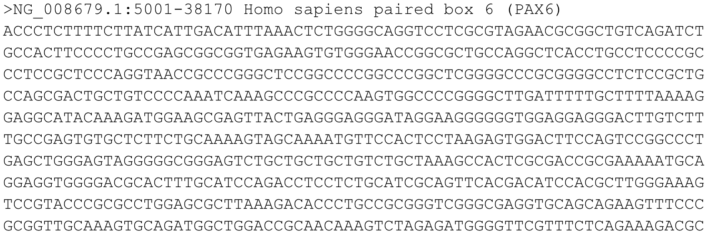
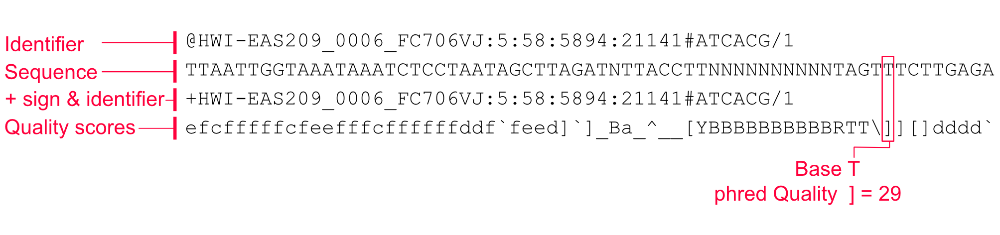
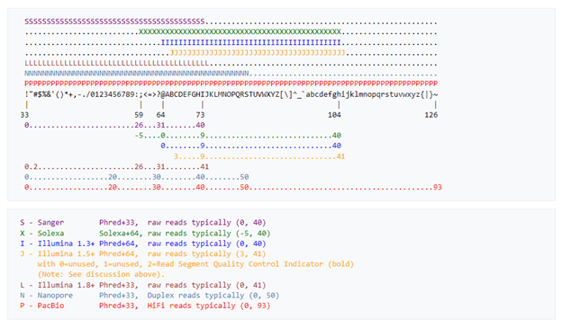
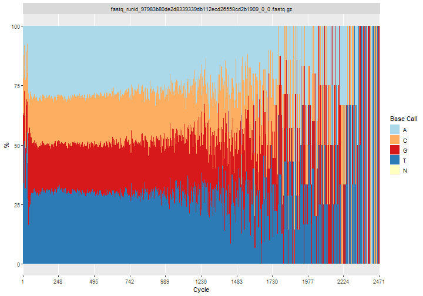

# Quality Check, Processing and Alignment of High-throughput Sequencing Reads

**Learning objectives:**

- difference between .fasta and .fastq files
- checking read quality with Rqc
- trimming and mapping .fastq files with QuasR

## .fasta vs .fastq

.fasta file starts with >


Fastq file has four components

Fastq scores depend on the sequencing platform

## Quality check with Rqc

[Rqc tutorial](http://www.bioconductor.org/packages/release/bioc/vignettes/Rqc/inst/doc/Rqc.html)

```{r, echo = TRUE, eval=FALSE}
library(Rqc)
folder = system.file(package="ShortRead", "extdata/E-MTAB-1147")

# feeds fastq.qz files to quality check function
qcRes=rqc(path = folder, pattern = ".fastq.gz")

```

```{r, echo = TRUE, eval=FALSE}
# try with long read data... not nearly as useful
qcResC=rqc(path = "example_files/example_fastqgz", pattern = ".fastq.gz")

```


An alternative: fastqcr (CRNA not Bioconductor) for lots of fastq files!
UNIX/MAC ONLY

[fastqcr tutorial](https://cran.r-project.org/web/packages/fastqcr/readme/README.html)


```{r, echo = TRUE, eval=FALSE}
library(fastqcr)
fastqc_install()
fastqc(fq.dir = folder,qc.dir = "fastqc_results")

# view the report rendered by R functions
qc_report(qc.path="fastqc_results", 
          result.file="reportFile", preview = TRUE)
```

## Filtering and trimming reads with the QuasR package

[Quasr](https://bioconductor.org/packages/release/bioc/vignettes/QuasR/inst/doc/QuasR.html#6_Example_workflows)

```{r, echo = TRUE, eval=FALSE}
library(QuasR)

# obtain a list of fastq file paths
fastqFiles <- system.file(package="ShortRead",
                          "extdata/E-MTAB-1147",
                          c("ERR127302_1_subset.fastq.gz",
                            "ERR127302_2_subset.fastq.gz")
)

# defined processed fastq file names
outfiles <- paste(tempfile(pattern=c("processed_1_",
                              "processed_2_")),".fastq",sep="")

# process fastq files
preprocessReads(fastqFiles, outfiles, 
                nBases=1,            # remove reads that have more than 1 N
                truncateEndBases=3,  # trim 3 bases from the end of the reads 
                Lpattern="ACCCGGGA", # Remove ACCCGGGA patern if it occurs at the start 
                minLength=40)        # remove reads shorter than 40 base-pairs 
```

## Mapping aligned reads to the genome (also with QuasR)
```{r, echo = TRUE, eval=FALSE}
library(QuasR)

# copy example data to current working directory
file.copy(system.file(package="QuasR", "extdata"), ".", recursive=TRUE)

# genome file in fasta format
genomeFile <- "extdata/hg19sub.fa"

# text file containing sample names and fastq file paths
sampleFile <- "extdata/samples_chip_single.txt"

# create alignments 
proj <- qAlign(sampleFile, genomeFile)
```


## Meeting Videos

### Cohort 2

`r knitr::include_url("https://www.youtube.com/embed/6FS9a7Ztq-Y")`
