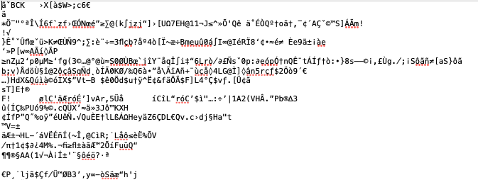
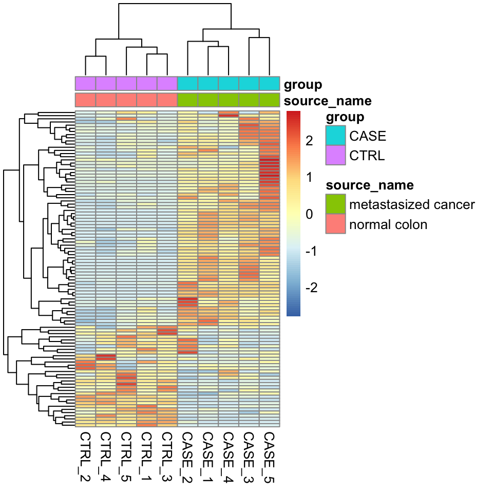
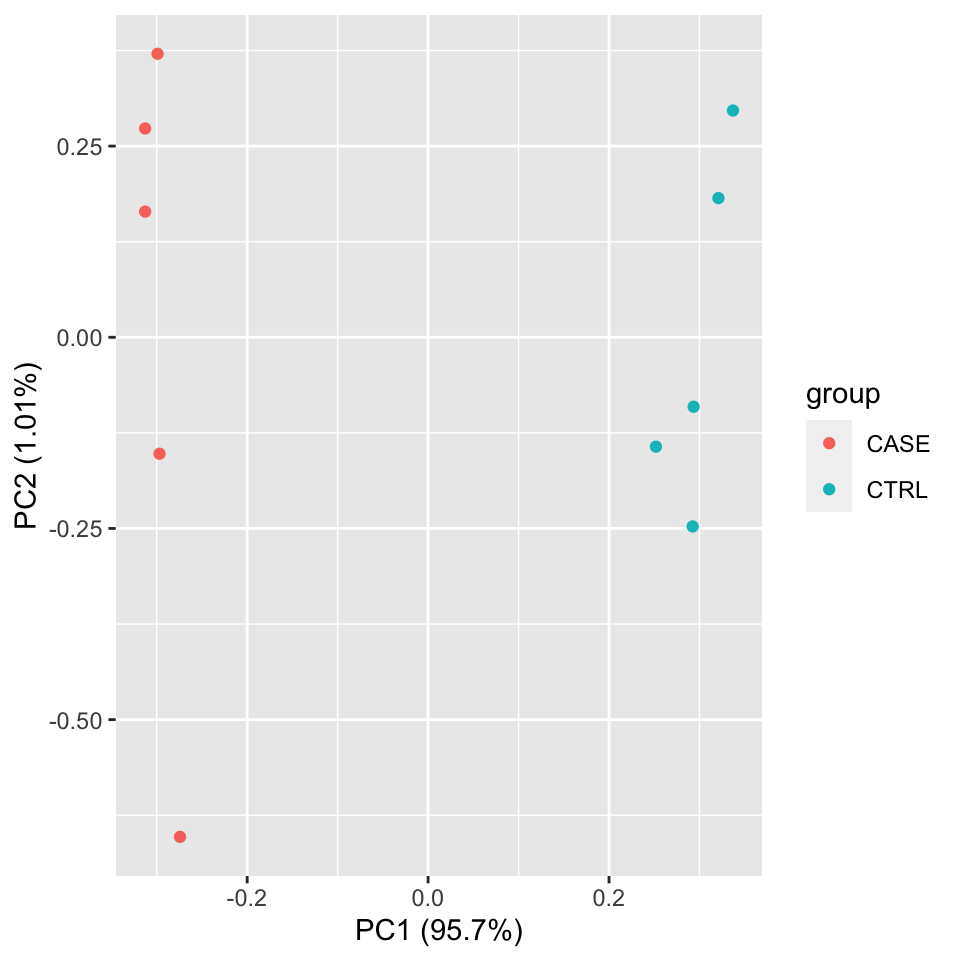
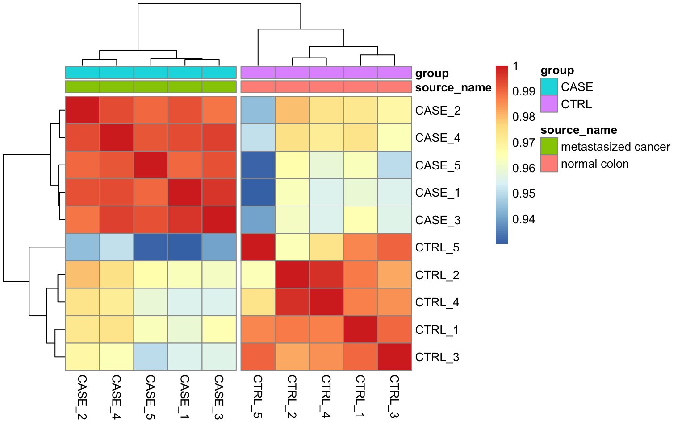
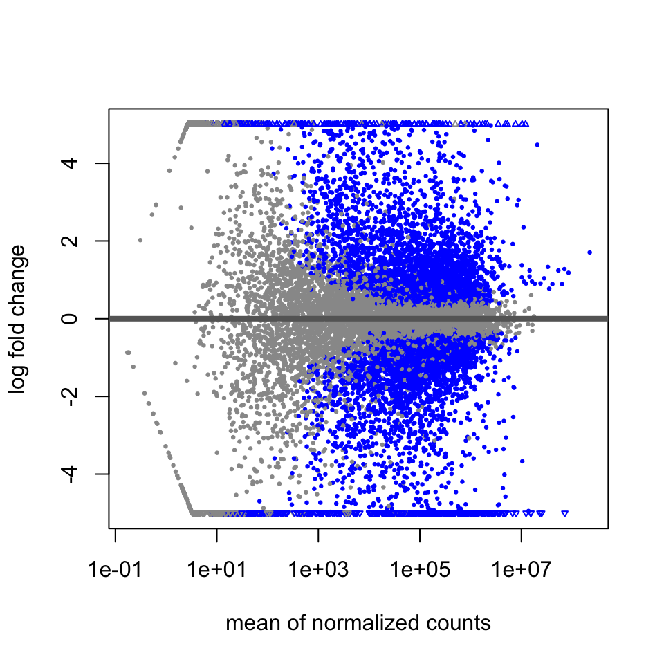
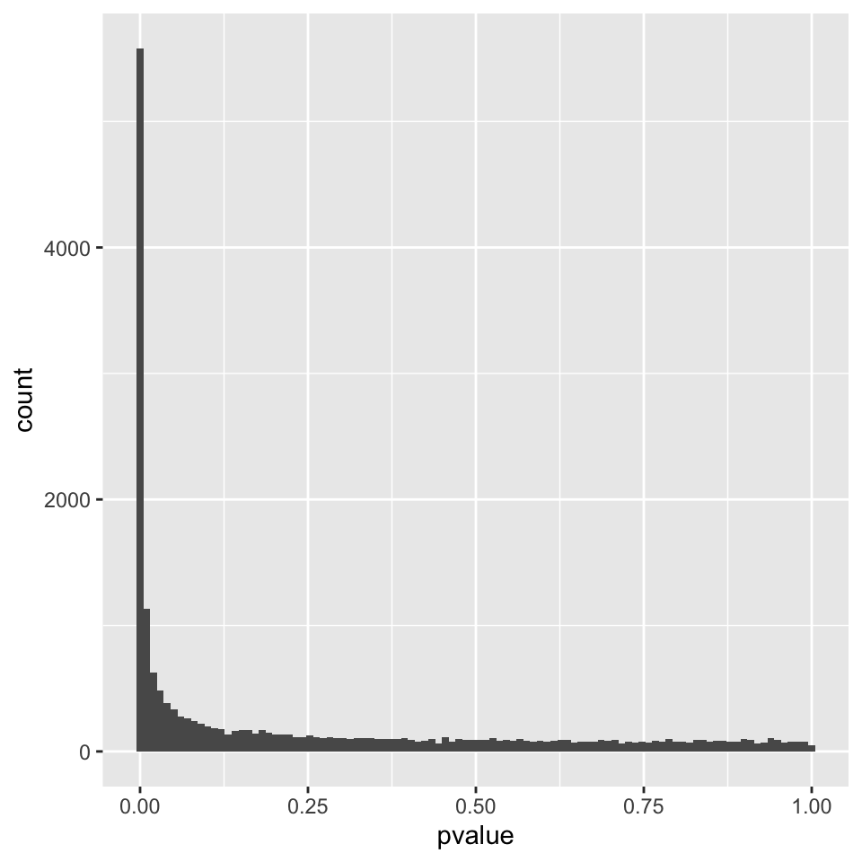
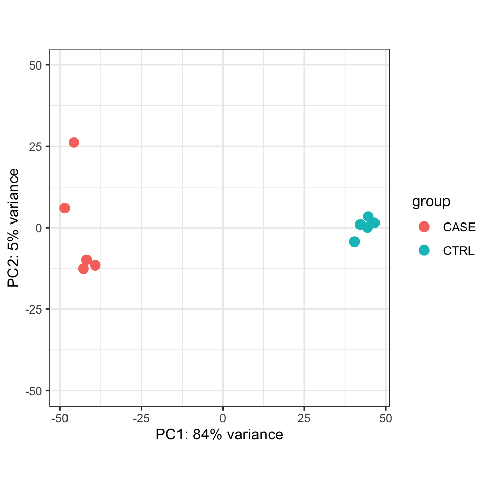
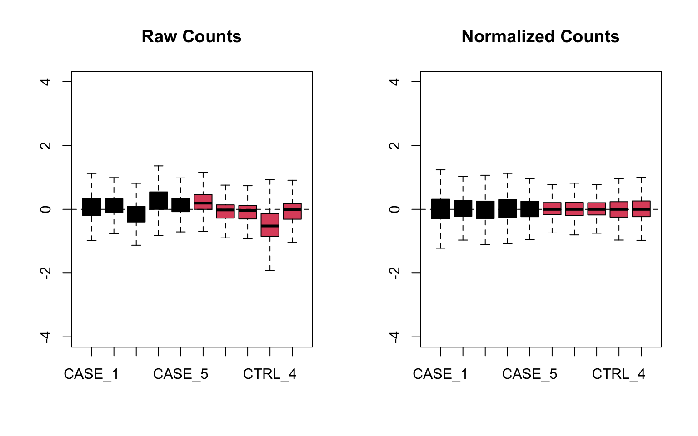
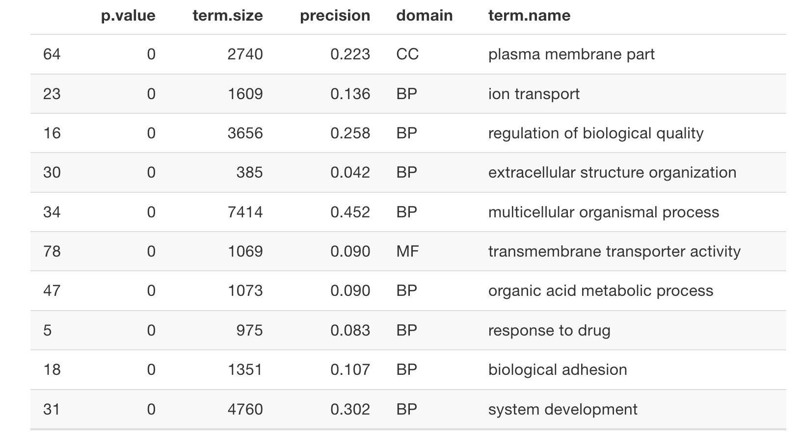
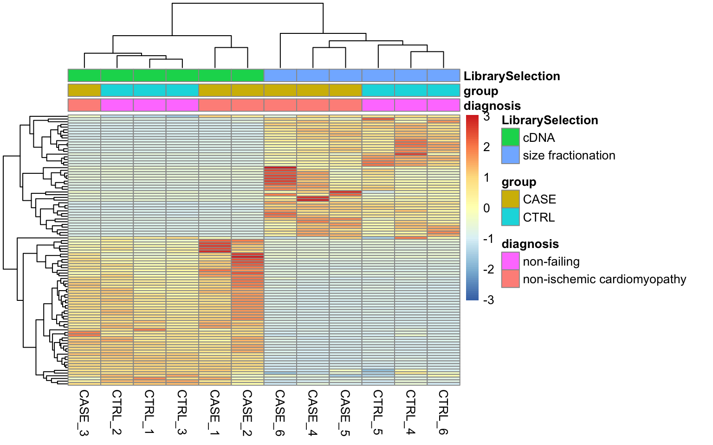

# RNA-seq Analysis

**Learning objectives:**

- Normalization
- Differenital gene expression
- Functional enrichment analysis

## Processing, alignment, quantification

- Processing & alignment see [Chapter 7](https://compgenomr.github.io/book/processingReads.html)

After Alignment we have a BAM/SAM file which is not human readable:



The same information can also be stored in a SAM file: 


Quantification can be performed already by alignment tools (e.g. STAR), but it can also be performed in R (`Rsubread::featureCounts`, `QuasR::qCount`, `GenomicAlignments::sumarizeOverlaps`)


## Normalization of the read counts

Factors to consider for normalization: 

- Library size
- Gene length
- transcriptome size
- GC content

__CPM__: counts per million
__RPKM/FPKM__: reads/fragments per kilobase of a million (first library size then gene lengths)
__TPM__: transcripts per million ()

The above mentioned techniques don't account for library composition (For instance, when comparing transcriptomes of different tissues, there can be sets of genes in one tissue that consume a big chunk of the reads, while in the other tissues they are not expressed at all)

--> `DEseq2` & `edgeR` use different algorithms to tackle this. 

## Exploratory analysis

Check for similarity of biological replicates.

- clustering
- PCA
- Correlation plots

(see also [Chapter 4](https://compgenomr.github.io/book/unsupervisedLearning.html))

__Clustering__ possible with different packages/functions (`stats::heatmap`, `pheatmap`, `ComplexHeatmap`).

```{r, eval=FALSE}
#compute the variance of each gene across samples
V <- apply(tpm, 1, var)
#sort the results by variance in decreasing order 
#and select the top 100 genes 
selectedGenes <- names(V[order(V, decreasing = T)][1:100])
```

```{r, eval=FALSE}
library(pheatmap)
colData <- read.table(coldata_file, header = T, sep = '\t', 
                      stringsAsFactors = TRUE)
pheatmap(tpm[selectedGenes,], scale = 'row', 
         show_rownames = FALSE, 
         annotation_col = colData)
```



__PCA__

```{r, eval=FALSE}
library(stats)
library(ggplot2)
#transpose the matrix 
M <- t(tpm[selectedGenes,])
# transform the counts to log2 scale 
M <- log2(M + 1)
#compute PCA 
pcaResults <- prcomp(M)

#plot PCA results making use of ggplot2's autoplot function
#ggfortify is needed to let ggplot2 know about PCA data structure. 
autoplot(pcaResults, data = colData, colour = 'group')
```




__Correlation plots__ 

```{r, eval=FALSE}
library(stats)
correlationMatrix <- cor(tpm)
```

```{r, eval=FALSE}
library(pheatmap)
# split the clusters into two based on the clustering similarity 
pheatmap(correlationMatrix,  
         annotation_col = colData, 
         cutree_cols = 2)
```



## Differential expression analysis

Limiting factors for detecting real changes between biological conditions: 

- number of biological replicates
- non-normality of the distribution of the read counts
- higher uncertainty of measurements for lowly expressed genes than highly expressed genes


`DESeq workflow`: 

- preparation of data

```{r, eval=FALSE}
#remove the 'width' column
countData <- as.matrix(subset(counts, select = c(-width)))
#define the experimental setup 
colData <- read.table(coldata_file, header = T, sep = '\t', 
                      stringsAsFactors = TRUE)
#define the design formula
designFormula <- "~ group"
```

- setting up dds 

```{r, eval=FALSE}
library(DESeq2)
library(stats)
#create a DESeq dataset object from the count matrix and the colData 
dds <- DESeqDataSetFromMatrix(countData = countData, 
                              colData = colData, 
                              design = as.formula(designFormula))
#print dds object to see the contents
print(dds)
```

```
## class: DESeqDataSet 
## dim: 19719 10 
## metadata(1): version
## assays(1): counts
## rownames(19719): TSPAN6 TNMD ... MYOCOS HSFX3
## rowData names(0):
## colnames(10): CASE_1 CASE_2 ... CTRL_4 CTRL_5
## colData names(2): source_name group
```

```{r, eval=FALSE}
#For each gene, we count the total number of reads for that gene in all samples 
#and remove those that don't have at least 1 read. 
dds <- dds[ rowSums(DESeq2::counts(dds)) > 1, ]
```

- wrapper function that implements __estimation of size factors__ to normalize the counts, __estimation of dispersion values__, and computing a __GLM model__ based on the experimental design formula

```{r, eval=FALSE}
dds <- DESeq(dds)
```

- extract results

```{r, eval=FALSE}
#compute the contrast for the 'group' variable where 'CTRL' 
#samples are used as the control group. 
DEresults = results(dds, contrast = c("group", 'CASE', 'CTRL'))
#sort results by increasing p-value
DEresults <- DEresults[order(DEresults$pvalue),]
```

```{r, eval=FALSE}
#shows a summary of the results
print(DEresults)
```

```
## log2 fold change (MLE): group CASE vs CTRL 
## Wald test p-value: group CASE vs CTRL 
## DataFrame with 19097 rows and 6 columns
##             baseMean log2FoldChange     lfcSE       stat       pvalue
##            <numeric>      <numeric> <numeric>  <numeric>    <numeric>
## CYP2E1       4829889        9.36024  0.215223    43.4909  0.00000e+00
## FCGBP       10349993       -7.57579  0.186433   -40.6355  0.00000e+00
## ASGR2         426422        8.01830  0.216207    37.0863 4.67898e-301
## GCKR          100183        7.82841  0.233376    33.5442 1.09479e-246
## APOA5         438054       10.20248  0.312503    32.6477 8.64906e-234
## ...              ...            ...       ...        ...          ...
## CCDC195      20.4981      -0.215607   2.89255 -0.0745386           NA
## SPEM3        23.6370     -22.154765   3.02785 -7.3170030           NA
## AC022167.5   21.8451      -2.056240   2.89545 -0.7101618           NA
## BX276092.9   29.9636       0.407326   2.89048  0.1409199           NA
## ETDC         22.5675      -1.795274   2.89421 -0.6202983           NA
##                    padj
##               <numeric>
## CYP2E1      0.00000e+00
## FCGBP       0.00000e+00
## ASGR2      2.87741e-297
## GCKR       5.04945e-243
## APOA5      3.19133e-230
## ...                 ...
## CCDC195              NA
## SPEM3                NA
## AC022167.5           NA
## BX276092.9           NA
## ETDC                 NA
```

## Diagnostic plots

__MA plot__



__p-value distribution__



__PCA__



__Relative Log Expression (RLE) plot__



## Functional enrichment analysis

__GO term analysis__

http://geneontology.org/

```{r, eval=FALSE}
library(DESeq2)
library(gProfileR)
library(knitr)
# extract differential expression results
DEresults <- results(dds, contrast = c('group', 'CASE', 'CTRL'))

#remove genes with NA values 
DE <- DEresults[!is.na(DEresults$padj),]
#select genes with adjusted p-values below 0.1
DE <- DE[DE$padj < 0.1,]
#select genes with absolute log2 fold change above 1 (two-fold change)
DE <- DE[abs(DE$log2FoldChange) > 1,]

#get the list of genes of interest
genesOfInterest <- rownames(DE)

#calculate enriched GO terms
goResults <- gprofiler(query = genesOfInterest, 
                     organism = 'hsapiens', 
                     src_filter = 'GO', 
                     hier_filtering = 'moderate')
```



__Gene set enrichment analysis__

...  is a valuable exploratory analysis tool that can associate systematic changes to a high-level function rather than individual genes.


## Accounting for additional sources of variation



```{r, eval=FALSE}
library(DESeq2)
# remove the 'width' column from the counts matrix
countData <- as.matrix(subset(counts, select = c(-width)))
# set up a DESeqDataSet object
dds <- DESeqDataSetFromMatrix(countData = countData, 
                              colData = colData, 
                              design = ~ LibrarySelection + group)
```

__IMPORTANT__: keep the variable of interest at the last position in design formula.

__Unknown source of variation__ --> `RUVSeq` or `sva`

`RUVg()` uses a set of reference genes, that shouldn't change due to the condition.

`RUVs()`  estimates the correction factor by assuming that replicates should have constant biological variation


## Meeting Videos

### Cohort 2

`r knitr::include_url("https://www.youtube.com/embed/URL")`

<details>
<summary> Meeting chat log </summary>
```
LOG
```
</details>
